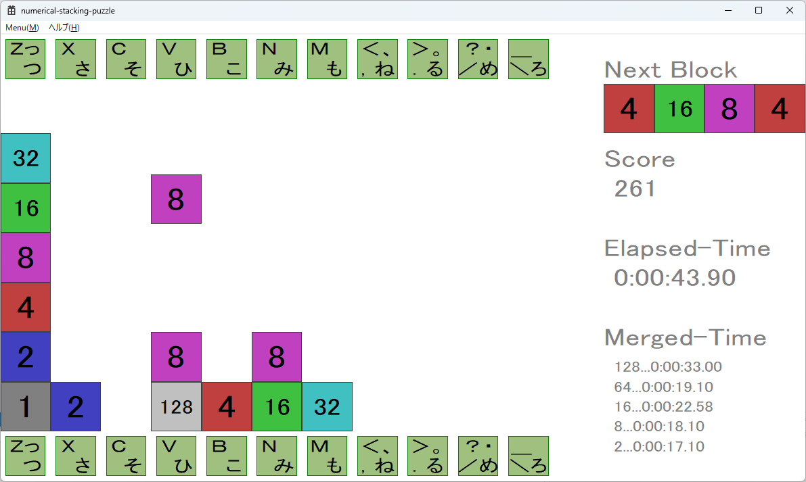

# Numerical Stacking Puzzle

A simple puzzle game where numbered blocks are stacked and merged.  
This repository contains multiple implementations (C++ , Python , unity(C#) and roblox(luau) ) of the same game.

---

## 概要
数値ブロックを積み上げていくパズルゲームです。
上下左右に同じ数字ブロックが揃うと、それらがマージされます。

---

## 実装

このプロジェクトは複数の言語で実装されています。

- C++版 → `cpp/`
- Python版 → `python/`
- Unity版 → `unity(csharp)/`
- Roblox版 → `roblox(luau)/`

それぞれの実装を比較することで、言語ごとの特性の違いを観察することができます。

---

## ゲーム内容（操作方法）

数値ブロックは  
`1 / 2 / 4 / 8 / 16 / 32`  
がサーブされます。  

マージされると、より大きな数値ブロックに変化します。

キーボードの  
`Z` `X` `C` `V` `B` `N` `M` `<` `>` `?` `_`  
を押すと、落下中の数値ブロックを移動できます。
（Roblox版は `A` `S` `D` 、、、）

ゲームオーバー条件はありません。

---

## スクリーンショット



---

## ディレクトリ構成

```
numerical-stacking-puzzle/
├── README.md
├── .gitignore
├── images/
│   └── screenshot.png
├── cpp/
│   ├── README.md
│   ├── numerical-stacking-puzzle.sln
│   └── numerical-stacking-puzzle/
│        ├── *.cpp / *.h   ← メインのソースコード
│        ├── *.rc          ← リソース
│        ├── *.ico         ← アイコン
│        ├── *.vcxproj     ← プロジェクト設定
│        └── *.filters     ← 表示設定
├── python/
│   ├── README.md
│   └── numerical-stacking-puzzle/
│        ├── *.py          ← メインのソースコード
│        └── *.wav         ← サウンドファイル
├── unity(csharp)/
│   ├── README.md
│   ├── numerical-stacking-puzzle
│   ├── Assets/
│   │   ├── Scripts/        ← C#ソースコード
│   │   ├── Scenes/         ← メインシーン
│   │   ├── Prefabs/        ← タイル・UIなど
│   │   ├── Audio/
│   │   ├── Input/
│   │   ├── Materials/
│   │   ├── Resources/
│   │   ├── TextMesh Pro/
│   │   └── _Recovery/
│   ├── ProjectSettings/
│   └── Packages/
roblox(luau)/
├── README.md
├── default.project.json  ← rojo用jsonファイル
├── rojo.exe.txt          ← ここにrojo.exeを配置します。
└── numerical-stacking-puzzle
    ├── src/              ← luauソースコード(アプリケーションスクリプト)
    ├── client/           ← luauソースコード(クライアントスクリプト)
    ├── server/           ← luauソースコード(サーバースクリプト)
    └── audio/            ← 効果音用サンプルwavファイル
```

---

## 動作環境

### C++版
- OS：Windows
- 開発環境：Visual Studio 2022
- 言語：C++

### Python版
- 言語：Python 3.13

### Unity版
- 言語：C#

### Roblox版
- 開発環境：Roblox Studio バージョン 0.728.0.7280895 (64bit)
- 言語：luau

---

## ビルド方法（C++版）

### 1. リポジトリをクローン
```bash
git clone https://github.com/miyabi-nari/numerical-stacking-puzzle.git
```

### 2. Visual Studio 2022で開く
```
cpp/numerical-stacking-puzzle.sln
```

### 3. ビルド・実行
- 「ビルド」→「ソリューションのリビルド」
- 「デバッグ」→「デバッグの開始」または「デバッグなしで開始」

---

## 特記事項

- 同じゲームを C++ と Python と Unity（C#） で実装
- 言語ごとの実装差を比較可能
- シンプルなロジックで学習用途にも適用可能

---

## 注意事項

- C++版はVisual Studio 2022前提の構成です。
- ビルド生成物（Debug等）はリポジトリに含まれていません。
- 環境によっては動作しない場合があります。

---

## 作者

- GitHub: https://github.com/miyabi-nari
